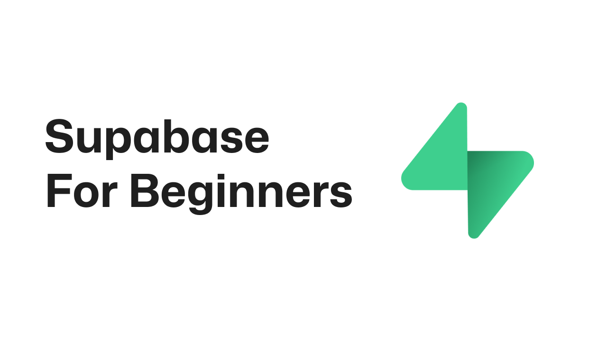

# Supabase for Beginners

Welcome to the **Supabase for Beginners** repository! This collection of tutorials, experiments, and resources is designed to help newcomers understand and navigate Supabase while building fun and functional applications.
This version anybody can make commits that get accepted.

## 📚 Table of Contents

| Title                                                   | Description                                                                 |
|---------------------------------------------------------|-----------------------------------------------------------------------------|
| 📦 [What is Supabase?](docs/supabase-introduction.md)        | An overview of Supabase and its role as an open-source Firebase alternative.|
| 🛠️ [Prerequisites](docs/prerequisites.md)               | Tools and accounts needed to get started with Supabase.                     |
| 📘 [Tutorials](tutorials/tutorials-overview.md)         | Hands-on tutorials to build applications using Supabase.                    |
| 💡 [Tips and Common Issues](docs/tips-and-common-issues.md) | Best practices and solutions to frequent challenges in Supabase.            |
| 📚 [Resources](docs/resources.md)                       | Additional documentation and community links.                               |

## Contributing

Contributions are welcome! If you have suggestions, find errors, or want to add more content, please:

1. Fork the repository.
2. Create a new branch for your changes.
3. Submit a pull request with a clear description of your changes.

For detailed contribution guidelines, please see our [Contributing](Contributing.md) file.

## 🎯 Presentation Resources

Want to share your Supabase knowledge with others? We've got you covered! This repository includes presentation materials you can use and customize:

### PowerPoint Template

Located in the `/presentation` folder, you'll find:

- A customizable PowerPoint presentation.

Feel free to:

- Modify the slides to match your style.
- Add your own examples and experiences.
- Translate the content to other languages.
- Use it for meetups, workshops, or team training.

> 💡 **Tip**: The presentation is designed to be beginner-friendly while covering all essential Supabase concepts.

## Support This Project

If you found this guide helpful, please consider sharing it with others:

