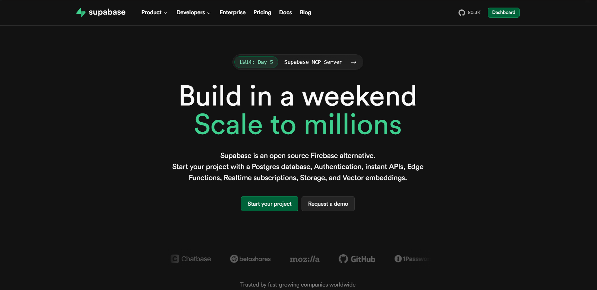

# What is Supabase?

Supabase is an open-source alternative to Firebase that helps developers build secure and scalable applications quickly. It uses PostgreSQL, a powerful relational database, as its foundation, providing flexibility and super features. Being open-source means you can view, modify, and host the code yourself, giving you more control and avoiding being tied to a single provider. [Learn more](https://supabase.com/) 

## Key Features

- **PostgreSQL Database**: At its heart, Supabase offers a PostgreSQL database, which you can use for your backend. [Explore PostgreSQL](https://supabase.com/docs/guides/database)

- **Authentication**: Built-in Authentication. Manage user sign-ups, logins, and permissions with built-in authentication services, supporting email, password and third-party providers. [Authentication Docs](https://supabase.com/docs/guides/auth)

- **Realtime Subscriptions**: Listen to database changes in real-time in the backend which enables features like live chats, notifications and collaborative editing. [Realtime Docs](https://supabase.com/docs/guides/realtime)

- **Storage**: Store and serve large files, such as images and videos, with built-in storage solutions. Plus its super fast [Storage Docs](https://supabase.com/docs/guides/storage)

- **Edge Functions**: Write server-side code and deploy globally, allowing for custom business logic and integrations. Very good for those using things like webhooks [Edge Functions Docs](https://supabase.com/docs/guides/functions)

## Benefits of Using Supabase

- **Open Source**: Supabase is fully open-source, allowing developers to inspect, modify, and contribute to the codebase. [GitHub Repository](https://github.com/supabase/supabase)

- **Scalability**: Built on PostgreSQL, Supabase can handle applications of all sizes, from small projects to enterprise-level solutions. [Scalability Insights](https://supabase.com/docs/guides/database/scaling)

- **Flexibility**: With direct access to the database and the ability to add extensions, developers have the freedom to customize their applications extensively. [Extensions Guide](https://supabase.com/docs/guides/database/extensions)

- **Free Plan**: The Free Plan offers unlimited API requests, supports up to 50,000 monthly active users, and includes a 500 MB database, 5 GB bandwidth, and 1 GB file storage, providing a robust environment for small projects. ​[Pricing Guide](https://supabase.com/pricing)

- **Community-Driven**: Being open-source, Supabase benefits from a vibrant community that contributes to its continuous improvement and offers support to fellow developers. [Join the Community](https://supabase.com/community)

**Real-World Applications:**

Many organizations and developers have leveraged Supabase to enhance their applications. For instance, companies like Mozilla and GitHub have utilized Supabase's features to build scalable and efficient solutions. [Case Studies](https://supabase.com/blog)

For a more detailed understanding, refer to the official [Supabase documentation](https://supabase.com/docs).

## Next Steps

> ➡️ **[Prerequisites](prerequisites.md)**
>
> Now that you have a basic overview of how Supabase operates, let's see what you need to get started.

[Back to Main](../README.md#table-of-contents)
