# Building a API in .NET 9 with Supabase

## Prerequisites
- Basic understanding of Supabase concepts
- A Supabase account
- Visual Studio (IDE)
- A simple .NET API project to work with (or you can create a new one during the tutorial)
- Familiar with .NET development
- Familiar with PostMan

## 🔍 The Breakdown

- [Create a Supabase project](#create-a-supabase-project)
- [Use Supabase Table Editor](#use-supabase-table-editor)
- [Supabase C# Client](#supabase-c-client)
- [Build an API with Supabase](#build-an-api-with-supabase)
- [Add the Supabase Client](#add-the-supabase-client)
- [Create Models for DB Interaction](#create-models-for-db-interaction)
- [Use PostgREST for APIs](#use-postgrest-for-apis)
- [Create Minimal API Endpoints](#create-minimal-api-endpoints)
- [Test Your Supabase API](#test-your-supabase-api)

## Create a Supabase project
So you basically logged in already but have no projects? you can either create the same one I am or your own example, pretty much anything goes. Access [**Supabase Dashboard**](https://supabase.com/dashboard).

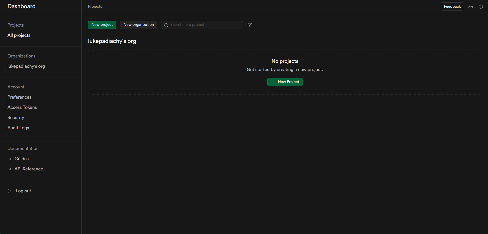

- Create a `New Project`
- Provide a `Name` for your Project
- Create your own `Password` or generate one, be sure to store password in a safe place if generated.
-  Select the `Region` closest to you
- Select Free `Pricing Plan`


- Click create: at this point you will have a view of options to choose from 

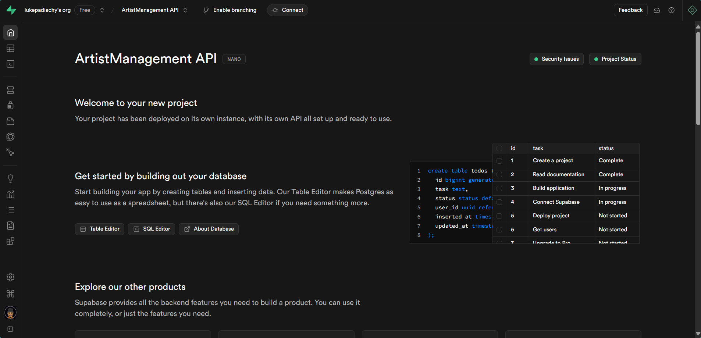


# Use Supabase Table Editor

- Select `Table Editor`: This is basically where we go to look at the tables we have in our database 


- Create a `new Table`: Basically we need a table to store our Artists.

- Add `artists` into name: You're able to set `Row Level Security` and support for real-time supscriptions  

- Disable `Row Level Security` for now , makes things easier for our API 
- You can define the `columns` you want to have 

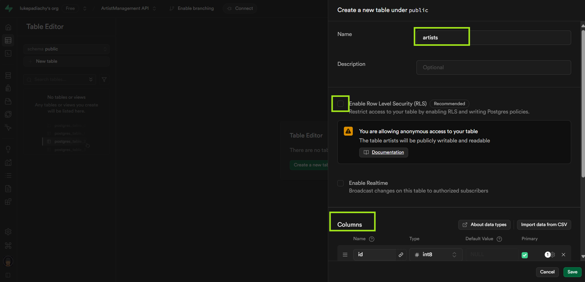

### Columns
You will already have `id` set as your **Primary key** , with `created_at` for the date by default. I added another column called `songs_released` as an `int4` , basically, it can store numbers up to around 2.1 billion and we removed `email`.

- Create the Artists table if you're happy about it.

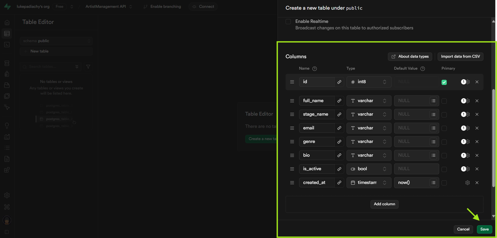

Now that our table is completely set up , let's `insert` some dummy data.

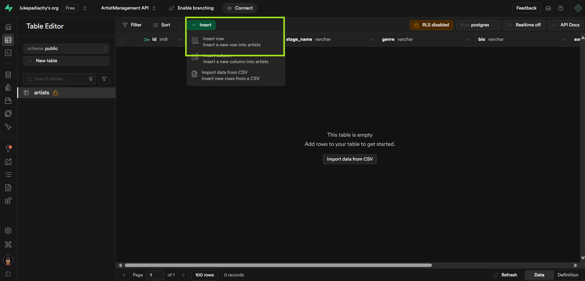

So when we insert some dummy data in here , you got a pretty convinient way of adding it via the UI, there's definetly ways you can do this in bulk, but for this tutorial, we'll use the UI.

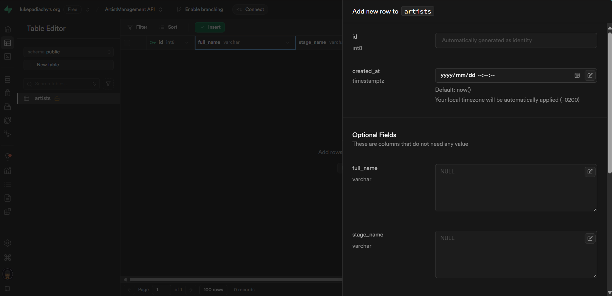

Once filling in the information, hit `save`. Now we got some data.

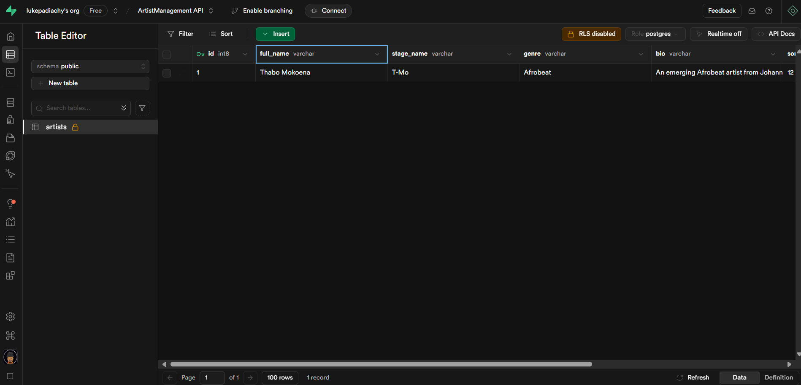

# Supabase C# Client
The Supabase C# Client is a community-driven library that allows C# developers to interact with Supabase services, including Postgres databases, authentication, real-time subscriptions and storage.

For more details, you can refer to the [official documentation](https://supabase.com/docs/reference/csharp/introduction) and the [GitHub repository](https://github.com/supabase-community/supabase-csharp).

# Build an API with Supabase
So you can definetly look at the tutorial project for some guidance on specific things. I have done a seperation of concerns regarding the services and dependencies in the project.

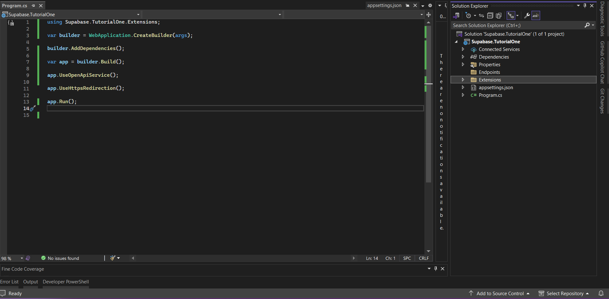

### Install the Package

There's two ways to make this happen:

Funny story , I was following a tutorial right and then I wanted to use the `supacbase-c-sharp` package only to find out, it has been depricated, in other words we freestyled the rest of this 

#### **Terminal** 

```bash
dotnet add package Supabase --version 1.1.1
``` 

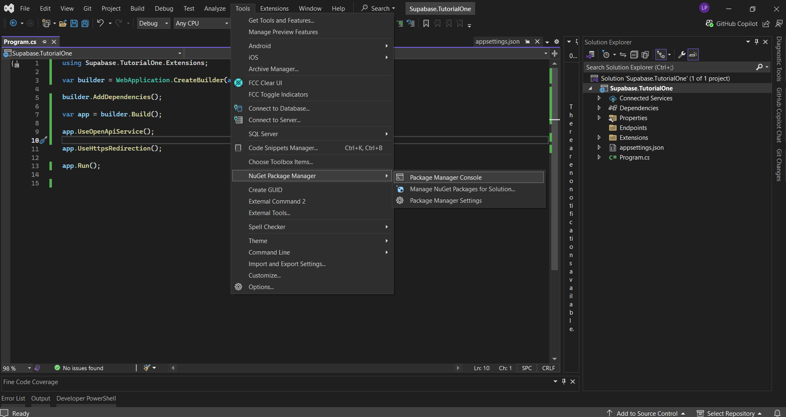


#### **Nuget Package Manager**

- Right-click on `Dependencies`
- Click on `Manage Nuget Packages`
- Make sure you're in the `Browse` Tab
- Search `Supabase` & `Install`

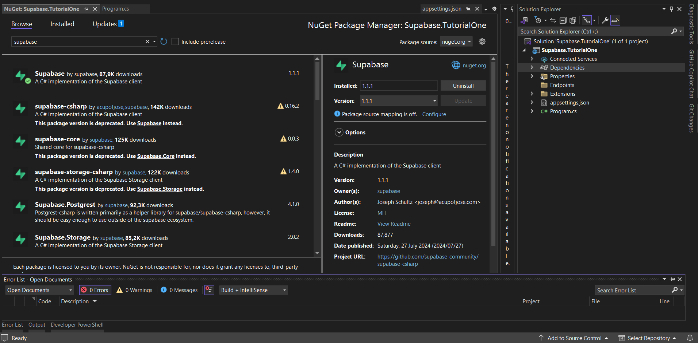

# Add the Supabase Client

After installing the Supabase package, we need to configure it in our application. Let's create a proper setup to inject the Supabase client into our services so we can use it throughout our API.

### Create a Supabase Configuration Extension

First, we'll create a extension class that will handle the Supabase client setup:

```csharp
namespace Supabase.TutorialOne.Extensions
{
    public static class SupabaseConfig
    {
        public static void AddSupabaseService(this IServiceCollection services, string url, string key)
        {
            services.AddScoped<Client>(provider =>
            {
                var options = new SupabaseOptions
                {
                    AutoRefreshToken = true,
                    AutoConnectRealtime = true
                };
                var supabaseClient = new Client(url, key, options);
                supabaseClient.InitializeAsync().Wait(); 
                return supabaseClient;
            });
        }
    }
}
```

This extension method:
- Adds the Supabase client as a scoped service to our dependency injection container
- Sets up the client with the provided URL and API key
- Configures it to automatically refresh authentication tokens when needed
- Configures it to automatically connect to Supabase's realtime features
- Initializes the client synchronously (the `Wait()` call makes sure initialization completes before returning)

### Update appsettings.json for Configuration

Add your Supabase URL and key to the application settings:

```json
{
  "Supabase": {
    "Url": "YOUR_SUPABASE_URL",
    "Key": "YOUR_SUPABASE_KEY"
  },
  "Logging": {
    "LogLevel": {
      "Default": "Information",
      "Microsoft.AspNetCore": "Warning"
    }
  },
  "AllowedHosts": "*"
}
```

> ⚠️ **Important**: In a production environment, never commit these secrets to your repository. Use a secure secrets management approach like user secrets or environment variables.

### Create a Dependencies Configuration

To keep our Program.cs clean and maintainable, we'll create a dependencies configuration extension:

```csharp
namespace Supabase.TutorialOne.Extensions
{
    public static class DependenciesConfig
    {
        public static void AddDependencies(this WebApplicationBuilder builder)
        {
            builder.Services.AddOpenApiService();

            var supabaseUrl = builder.Configuration["Supabase:Url"];
            var supabaseKey = builder.Configuration["Supabase:Key"];
            builder.Services.AddSupabaseService(supabaseUrl, supabaseKey);
        }
    }
}
```

This extension:
- Retrieves Supabase settings from our configuration
- Calls our previously created `AddSupabaseService` method to configure the client
- Also adds OpenAPI service (for Swagger documentation)

### Keep Program.cs Clean

Our Program.cs file remains clean and straightforward:

```csharp
using Supabase.TutorialOne.Extensions;

var builder = WebApplication.CreateBuilder(args);

builder.AddDependencies();

var app = builder.Build();

app.UseOpenApiService();

app.UseHttpsRedirection();

app.Run();
```

We've kept our Program.cs clean and focused by:
1. Moving all dependency configuration to a dedicated extension method
2. Using a single `builder.AddDependencies()` call instead of cluttering it with service registrations
3. Following separation of concerns by keeping Supabase configuration in its own file

This approach makes our program more maintainable and easier to understand, especially for beginners. It also allows us to easily add more services in the future without making Program.cs more complex.

###  Get Your Supabase Credentials
To make your application work with Supabase, you'll need your project URL and API key:

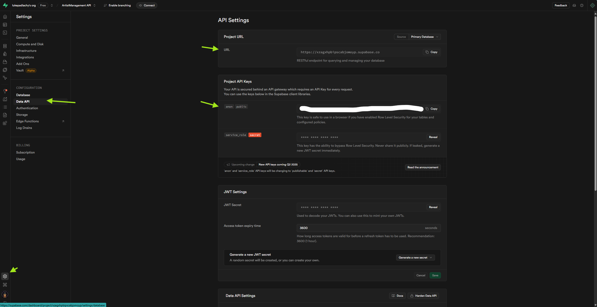

- Go to your Supabase project dashboard
- Click on the "Settings" icon in the left sidebar
- Select "API" from the menu
- You'll find your "Project URL" and "API Key" (use the anon/public key for this tutorial)

# Create Models for DB Interaction

To interact with our Supabase database, we need to create model classes that represent our database tables. These models map database columns to C# properties, allowing us to work with database records as objects in our code.

### Creating the Artist Model

Let's create a model for our `artists` table:

```csharp
using Supabase.Postgrest.Attributes;
using Supabase.Postgrest.Models;

namespace Supabase.TutorialOne.Models
{
    [Table("artists")]
    public class ArtistManagement : BaseModel
    { 
        [PrimaryKey("id",false)] // this is auto-generated
        public long Id { get; set; }

        [Column("full_name")]
        public string FullName { get; set; } = string.Empty;
        
        [Column("stage_name")]
        public string? StageName { get; set; }

        [Column("genre")]
        public string? Genre { get; set; }

        [Column("bio")]
        public string? Bio { get; set; }

        [Column("songs_released")]
        public int? SongsReleased { get; set; }

        [Column("is_active")]
        public bool? IsActive { get; set; }

        [Column("created_at")]
        public DateTime? CreatedAt { get; set; }
    }
}
```

### Understanding the Model

Our `ArtistManagement` model:

Inherits from `BaseModel` (provided by Supabase) which gives it functionality for working with Postgrest
    Uses Supabase attributes to map to our database table:
   - `[Table("artists")]` - Maps the class to the "artists" table in Supabase
   - `[PrimaryKey("id", false)]` - Maps the Id property to the primary key column, with `false` indicating it's auto-generated
   - `[Column("column_name")]` - Maps each property to its corresponding database column

Includes nullable types (`string?`, `int?`, etc.) for optional fields, making them more flexible


These are specifically designed to work with Supabase's API and provide the correct mapping between your C# code and the Supabase database.

Now that we've created our model, we're ready to build API endpoints that will use this model to interact with our Supabase database.

### Setting Up API Endpoints Structure

After creating our model, we need to establish endpoint structures that will allow our API to interact with Supabase. Let's create a file to handle these endpoints:

```csharp
namespace Supabase.TutorialOne.Endpoints
{
    public static class ArtistEndpoint
    {
        public static void AddArtistEndpoints(this WebApplication app) 
        {
            // Add the endpoints for the artist management
        }

        // Classes to map the request and response for Artists
        public class CreateArtistRequest
        {
            public string FullName { get; set; } = string.Empty;
            public string? StageName { get; set; }
            public string? Genre { get; set; }
            public string? Bio { get; set; }
            public int? SongsReleased { get; set; }
            public bool? IsActive { get; set; }
        }

        public class ArtistRequestResponse
        {
            public long Id { get; set; }
            public string FullName { get; set; } = string.Empty;
            public string? StageName { get; set; }
            public string? Genre { get; set; }
            public string? Bio { get; set; }
            public int? SongsReleased { get; set; }
            public bool? IsActive { get; set; }
            public DateTime? CreatedAt { get; set; }
        }
    }
}
```

### Understanding the Endpoint Structure

**Extension Method Pattern**: We're using an extension method (`AddArtistEndpoints`) that will allow us to easily add these endpoints to our application in Program.cs.

**Data Transfer Objects (DTOs)**:
   - `CreateArtistRequest`: Defines the shape of data coming from clients when creating an artist
   - `ArtistRequestResponse`: Defines the shape of data we send back to clients

**Separation of Concerns**: By keeping our request/response models separate from our database model, we:
   - Have better control over what data is exposed to clients
   - Can evolve our API independently from our database schema
   - Can add validation specific to API inputs without affecting our database model

This setup prepares us for implementing actual API endpoints that will interact with our Supabase database using our model. In the next section, we'll add the actual functionality to create, retrieve, and delete artists.

# Use PostgREST for APIs

Let's take a quick detour to look at [**PostgREST**](https://docs.postgrest.org/en/v12/)

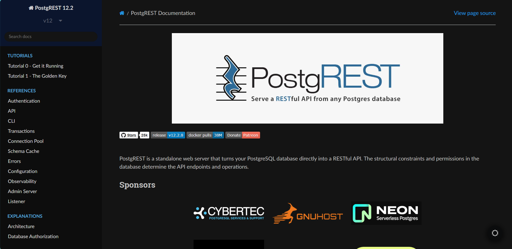

**PostgREST** is a tool that instantly turns your PostgreSQL database into a RESTful API. If you're using Supabase like we are,  we already have access to a **PostgREST** server right out the box. Which will expose a RESTful API with CRUD endpoints for our database. The endpoints we going to build are already available with **PostgREST** and we wont need to create it from scratch. Basically the route we taking in this tutorial is just to showcase, "how" if you wanted to add extra business logic to your CRUD operations.

# Create Minimal API Endpoints

Now that we have set up our models and endpoint structure, let's implement the actual API endpoints to interact with our Supabase database. We'll create three basic CRUD operations: POST (create), GET (read), and DELETE.

### Create `POST` Endpoint

The POST endpoint allows clients to create a new artist in our database:

```csharp
app.MapPost("/artists", async (CreateArtistRequest request, Supabase.Client client) =>
{
    var artist = new ArtistManagement
    {
         FullName = request.FullName,
         StageName = request.StageName,
         Genre = request.Genre,
         Bio = request.Bio,
         SongsReleased = request.SongsReleased,
         IsActive = request.IsActive,
         CreatedAt = DateTime.UtcNow
    };
    var response = await client.From<ArtistManagement>().Insert(artist);
    var newArtist = response.Models.First();
    return Results.Ok(newArtist.Id);
});
```

This endpoint:
- Takes a `CreateArtistRequest` object from the request body
- Automatically receives the Supabase client through dependency injection
- Creates a new `ArtistManagement` object from the request data
- Uses the Supabase client to insert the artist into the database
- Returns the ID of the newly created artist

### Create `GET` Endpoint

The GET endpoint retrieves a specific artist by ID:

```csharp
app.MapGet("/artists/{id}", async (long id, Supabase.Client client) =>
{
    // this is our body, supabase supports LINQ queries
    var response = await client
    .From<ArtistManagement>()
    .Where(n => n.Id == id)
    .Get();

    var artists = response.Models.FirstOrDefault();

    if (artists is null)
    {
        return Results.NotFound();
    }
    var artistResponse = new ArtistRequestResponse
    {
        Id = artists.Id,
        FullName = artists.FullName,
        StageName = artists.StageName,
        Genre = artists.Genre,
        Bio = artists.Bio,
        SongsReleased = artists.SongsReleased,
        IsActive = artists.IsActive,
        CreatedAt = artists.CreatedAt
    };

    return Results.Ok(artistResponse);
});
```

This endpoint:
- Takes an artist ID from the URL path
- Uses Supabase's LINQ support to query for the specific artist
- Returns a 404 Not Found response if no artist with that ID exists
- Maps the database model to our API response model
- Returns the artist data as a 200 OK response

### Create `DELETE` Endpoint

The DELETE endpoint removes an artist from the database:

```csharp
app.MapDelete("/artists/{id}", async (long id, Supabase.Client client) =>
{
    await client
    .From<ArtistManagement>()
    .Where(n => n.Id == id)
    .Delete();

    return Results.Ok();
});
```

This endpoint:
- Takes an artist ID from the URL path
- Uses the Supabase client to delete the artist with the specified ID
- Returns a 200 OK response to indicate success

### Register the Endpoints in Program.cs

To make these endpoints available in our application, we need to call our extension method in Program.cs:

```csharp
app.AddArtistEndpoints();
```

This single line registers all our artist endpoints with the application. The complete Program.cs file now looks like:

```csharp
using Supabase.TutorialOne.Endpoints;
using Supabase.TutorialOne.Extensions;

var builder = WebApplication.CreateBuilder(args);

builder.AddDependencies();

var app = builder.Build();

app.UseOpenApiService();

app.UseHttpsRedirection();

app.AddArtistEndpoints();

app.Run();
```

We'll test our API to ensure it's working correctly with our Supabase database.

# Test Your Supabase API (Postman)
Surprised we using **Postman**? me too. Im still getting into it myself.

But just to assure you that things are happening right? we can still view if information is coming through from `Supabase`

- `Run` your Project
- `Change` your url from 
```bash
https://localhost:7060
```
to , be sure to add actually Id like `1` , not `{id}`

```bash
https://localhost:7060/artists/{id}
```

You should then see something like this:

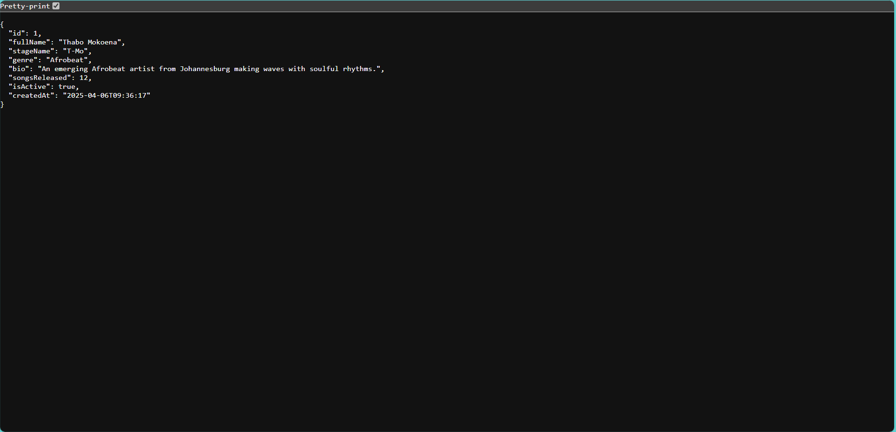

woohoo! we got an artist coming from our Supabase database

## Heading to Postman
Below is a step-by-step guide for testing the Supabase artist endpoints using Postman. Since our API is running at https://localhost:7060


## Step 1: Set up Postman Collection

- Open Postman
- Click "Create a new Collection" in the sidebar
- Name it "Whatever you like"
- Save the collection

## Step 2: Testing GET - Retrieve an Artist

- Create another new request
- Set the request type to **GET**
- Enter URL: `https://localhost:7060/artists/{id}`
   - Replace `{id}` with the actual ID returned from the POST request
- Click "Send"
- You should receive a `200 OK` response with the artist's details:
   
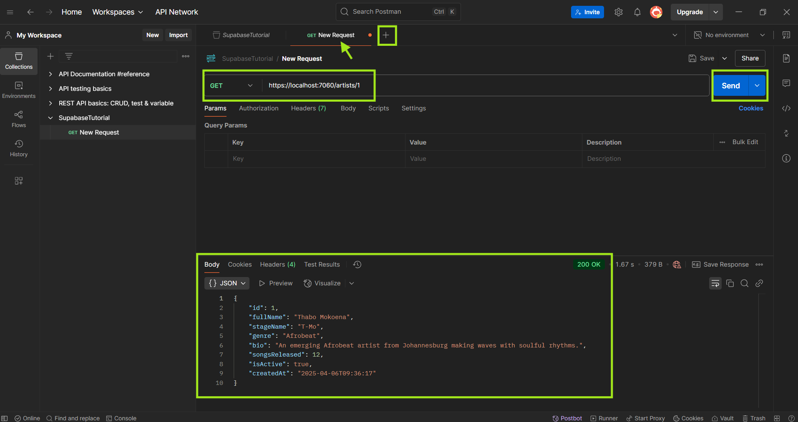

- If the artist doesn't exist, you'll receive a `404 Not Found`


## Step 3: Testing POST - Create an Artist

- Click the "+" button to create a new request
- Set the request type to **POST**
- Enter URL: `https://localhost:7060/artists`
- Go to the "Headers" tab and add:
   - Key: `Content-Type`
   - Value: `application/json`

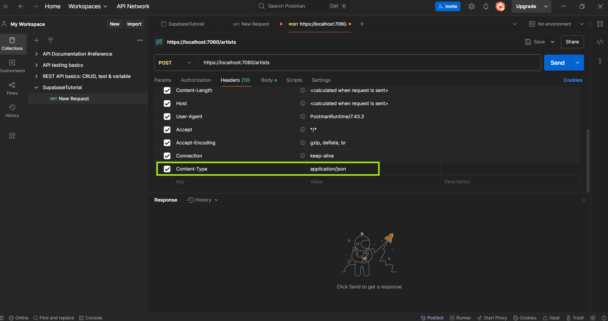
   
- Go to the "Body" tab, select "raw" and choose "JSON" format

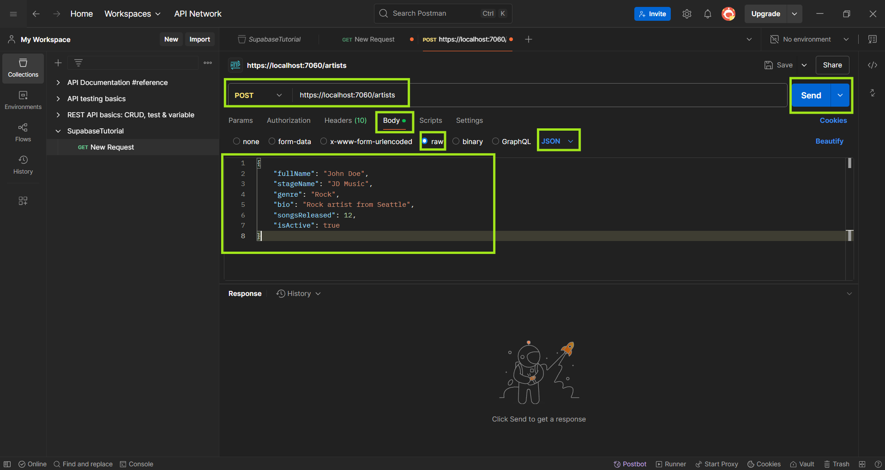

6. Enter the following request body:
   ```json
   {
     "fullName": "John Doe",
     "stageName": "JD Music",
     "genre": "Rock",
     "bio": "Rock artist from Seattle",
     "songsReleased": 12,
     "isActive": true
   }
   ```
7. Click "Send"

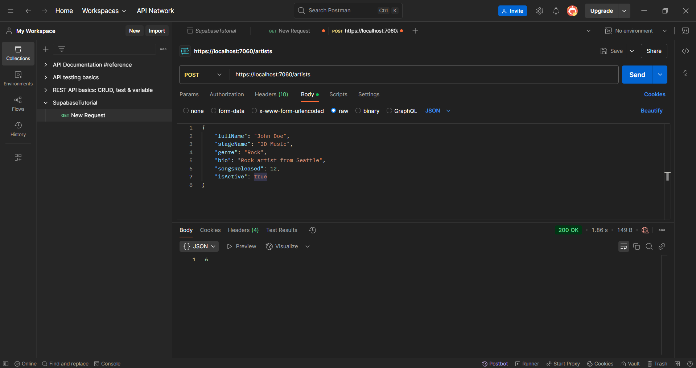

8. You should receive a `200 OK` response with the ID of the newly created artist

9. Let's look at our table inside of **Supabase**

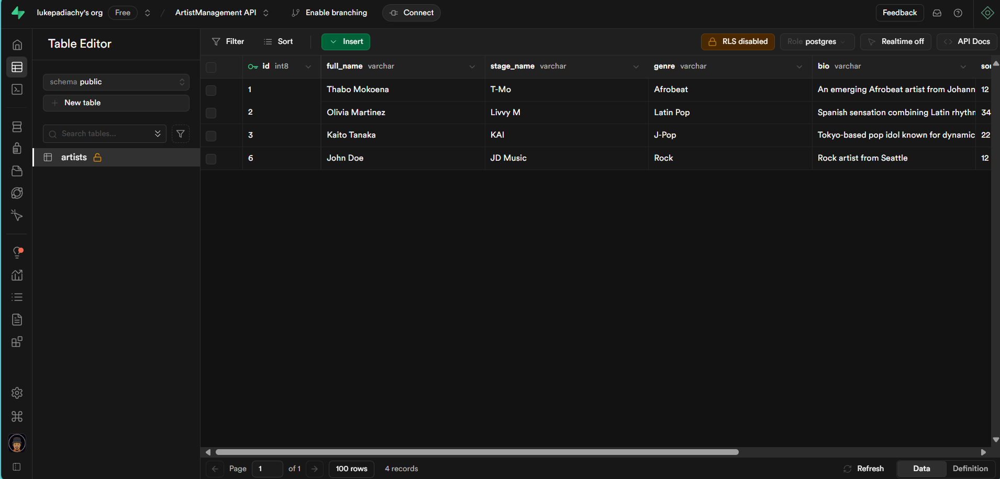


## Step 3: Testing DELETE - Remove an Artist

1. Create another new request
2. Set the request type to **DELETE**
3. Enter URL: `https://localhost:7060/artists/{id}`
   - Replace `{id}` with the actual ID of the artist you want to delete
5. Click "Send"


6. You should receive a `200 OK` response with an empty body

## Step 5: Verify Deletion

1. Try to GET the deleted artist using the same ID
2. You should receive a `404 Not Found` response, confirming the deletion was successful

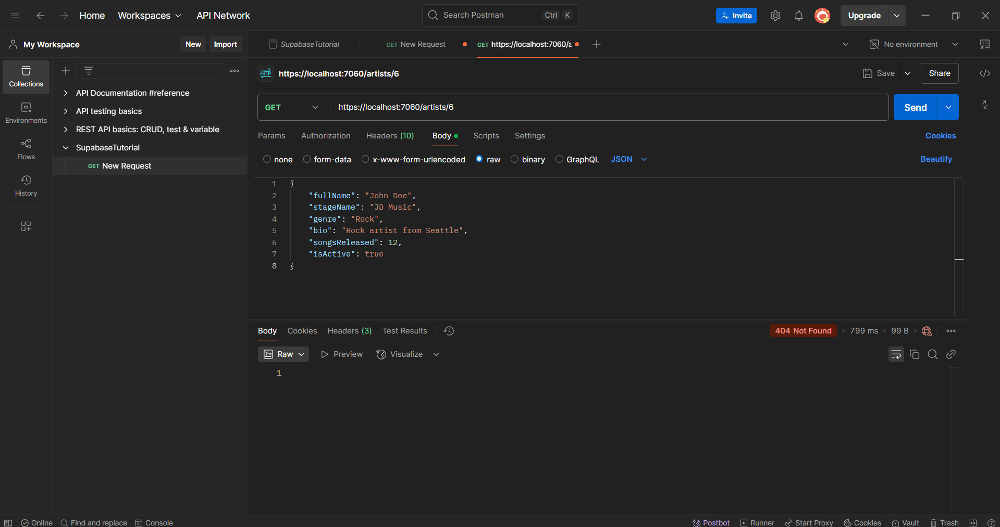

Let's check on **Supabase**

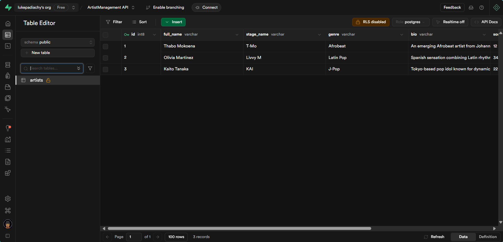


## Notes on the Endpoints

- **POST `/artists`**: Creates a new artist record in Supabase
- **GET `/artists/{id}`**: Retrieves an artist by ID
- **DELETE `/artists/{id}`**: Deletes an artist by ID

## Troubleshooting

- If you get SSL certificate errors, you may need to disable SSL verification in Postman settings
- Make sure the API project is running in the correct environment
- Verify the port number (7060/whichever yours is) matches what's shown in your terminal
- Check your Supabase connection settings in `appsettings.Development.json` if database operations fail


# Congratulations! 🎉
You've successfully completed this Supabase tutorial! By following along, you have:

- Created and configured a Supabase project
- Set up database tables using the Supabase Table Editor
- Integrated Supabase with your .NET 9 API application
- Built a clean, maintainable API structure with proper separation of concerns
- Implemented RESTful endpoints to perform CRUD operations
- Connected your .NET application to Supabase using the C# client
- Tested your API endpoints with Postman

Keep building and exploring what's possible with .NET and Supabase! 💻🚀